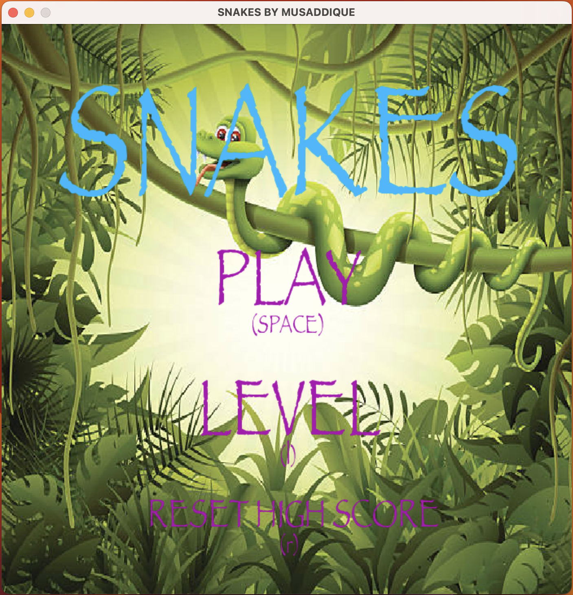

# Snake Game 🐍

    

    
    
    
    

## What I Learned 🧠

In the development of this Snake Game project, I acquired valuable knowledge and skills, including:

1. **Game Development with Pygame** 🎮: I learned how to create a 2D game using Pygame, a popular Python library for game development.

2. **Collision Detection** 🚧: I implemented collision detection to handle interactions between the snake and food, ensuring game logic runs smoothly.

3. **Game Over Conditions** ⚠️: I developed game over conditions for scenarios like snake collision with walls and self, providing players with a clear end to the game.

4. **High Score Tracking** 🏆: I implemented a high score system, storing and updating high scores in a text file.

5. **User Interface with Tkinter** 💼: I added a user interface for level selection using Tkinter, enabling players to choose game difficulty.

6. **Sound Effects and Music Integration** 🔊: I incorporated sound effects and music to enhance the gaming experience, making it more immersive.

The development of this Snake Game project has not only improved my Python programming skills but also introduced me to the world of game development and user interface design.

## Table of Contents 📜
- [Description](#description)
- [Demo](#demo)
- [Game Development with Pygame](#game-development-with-pygame)
- [User Interface with Tkinter](#user-interface-with-tkinter)
- [License](#license)
- [Author](#author)

## Description 📝
This Snake Game is a classic 2D arcade game in which the player controls a snake to eat food and grow longer. The game features various levels of difficulty, and the goal is to achieve the highest possible score without colliding with the walls or the snake's own body.

## Demo 🚀
You can play the Snake Game by running the Python script in your local environment. Choose your preferred level, control the snake, eat the food, and aim for the high score.

## Game Development with Pygame 🎮
The Snake Game is developed using Pygame, a Python library for game development. Key features and elements of the game include:
- Snake movement and control.
- Food generation and collision detection.
- High score tracking and updates.
- Game over conditions.
- Sound effects and music integration.

## User Interface with Tkinter 💼
The project also includes a user interface developed with Tkinter. Players can choose from different game difficulty levels, making the game accessible to a wide range of players.

## License 📜
This project is licensed under the MIT License. See the [LICENSE](LICENSE) file for details.

## Author 👨‍💻
- Author: musaddique333 

---

Enjoy playing the Snake Game! If you have any questions or feedback, please don't hesitate to reach out. 🐍
